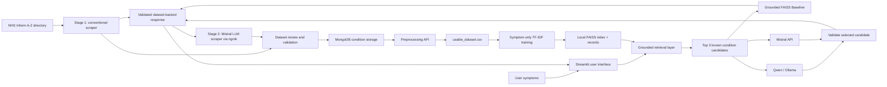

# 🚀 [Tips Hindawi](https://www.tipshindawi.com/) Challenge (June–July) 2026

> 🏆 This repository is my official submission for the [ **Tips Hindawi** ](https://www.tipshindawi.com/) **Challenge (June–July) 2026**.

| Field | Value |
| --- | --- |
| Full name | Mohamed Waled Abd AL-hamed |
| Project name | **Medical Condition Assistant** |
| GitHub username | [MOoWaled](https://github.com/MOoWaled) |
| Challenge batch | June–July 2026 |
| Training program | Large Language Models (LLMs) Program |
| Organization     | [**Edrak for Ai**](https://edrak4ai.com/

## 📖 Project Overview

The Medical Condition Assistant accepts a free-text symptom description and retrieves the closest conditions from a curated local knowledge base. The dataset was scraped from the [NHS Inform A–Z conditions directory](https://www.nhsinform.scot/illnesses-and-conditions/a-to-z/), then cleaned, reviewed, structured, and prepared for retrieval.

The response always uses the stored symptoms, causes, warnings, and recommendations for a condition in that dataset. This makes the application suitable for demonstrating an end-to-end data, RAG, and LLM-integration workflow while keeping the final content grounded in known records.

Three interface choices are available:

- **Grounded FAISS Baseline** — a local symptom-only TF-IDF + FAISS retrieval baseline.
- **Qwen** — Qwen/Ollama selects only from the retrieved candidates.
- **Mistral** — a custom ngrok/Flask Mistral endpoint or the official Mistral API selects only from the retrieved candidates.

The LLMs do not author medical facts. They can choose a retrieved condition, but the UI displays the knowledge-base record itself.

## 🗂️ Data Collection and Preparation Journey

### 1. Source and first scraping stage

The original source is the NHS Inform A–Z medical conditions directory. A conventional Python scraper was first created to collect the condition name and the available structured sections, including symptoms, causes, warnings, and recommendations.

Some source pages did not expose all information directly in the main page body; parts of the content were reachable through linked content. As a result, the first scraper could correctly collect the available fields but left some records incomplete.

### 2. LLM-assisted completion stage

To address incomplete fields, a second **LLM scraper** workflow was designed. It sends a targeted prompt to a Mistral LLM to complete the missing structured fields from the relevant linked content. The local code and the Mistral service were connected through an ngrok tunnel, allowing the scraper to request completions from the hosted model.

The completed dataset was then reviewed carefully to check structure, consistency, and content quality before it was used by downstream components. The LLM-assisted step improves dataset completeness; it does not replace the review step.

### 3. Storage, preprocessing, and model-ready data

After review, the condition records were transferred to MongoDB for structured storage and repeatable data access. A preprocessing API cleans medical text with tokenisation, stop-word removal, and lemmatisation, producing the cleaned symptom representations used by the retrieval baseline.

The final project dataset is stored in `dataset/usable_dataset.csv`. The baseline fits a TF-IDF representation on the symptom field and builds a local FAISS index. This retrieval-based design avoids presenting a misleading supervised accuracy score when the dataset contains approximately one source document per condition.

## 🏗️ Architecture



### Grounding rules

1. Retrieval runs before every model choice.
2. Candidate conditions come only from the local dataset.
3. Qwen and Mistral are instructed to return one exact candidate condition name.
4. If a model selects an unknown name, the top retrieved candidate is used instead.
5. Symptoms, causes, warnings, and recommendations shown in the UI are retrieved source fields, not generated prose.

## ✨ Features

- Symptom-only local baseline that avoids a misleading one-example-per-label classifier.
- TF-IDF + FAISS cosine-similarity retrieval over the project dataset.
- Shared RAG layer for the baseline, Qwen, and Mistral paths.
- Source-grounded structured fields: condition, symptoms, causes, warnings, and recommendations.
- Qwen support for both Ollama `/api/chat` and `/api/generate` contracts.
- Mistral support for a custom `/generate` endpoint and `https://api.mistral.ai/v1`.
- Clear endpoint errors for unavailable ngrok tunnels, invalid responses, and missing keys.
- A launcher that creates a virtual environment and installs dependencies automatically.
- Two-stage data collection: conventional scraping followed by Mistral-assisted completion for missing fields.
- MongoDB storage and a preprocessing API for reusable structured-data workflows.

## 🛠️ Technologies Used

- Python 3.10+
- Streamlit and Flask
- scikit-learn TF-IDF
- FAISS
- pandas, NumPy, NLTK
- requests
- Sentence Transformers (optional semantic-index builder)
- Qwen/Ollama and Mistral API integrations
- MongoDB / GridFS (optional for the scraper and legacy artifacts)

## ⚙️ Installation

### One-click Windows setup

1. Clone the repository.
2. Double-click `run_the_ChatBot.bat`.

The launcher creates `.venv`, installs `requirements.txt`, downloads the required NLTK resources, creates or refreshes the local baseline artifacts, and opens:

- Grounded Baseline API: `http://localhost:5000`
- Streamlit UI: `http://localhost:8501`

### Manual setup

```powershell
python -m venv .venv
.\.venv\Scripts\Activate.ps1
python -m pip install --upgrade pip
python -m pip install -r requirements.txt
python model_API\train_baseline.py
python model_API\app.py
```

In a second terminal:

```powershell
.\.venv\Scripts\Activate.ps1
streamlit run gui\app.py
```

## 🚀 Usage

1. Open `http://localhost:8501`.
2. Choose **Grounded FAISS Baseline**, **Qwen**, or **Mistral**.
3. Enter a symptom description.
4. Select **Analyse symptoms**.

### Qwen configuration

Enter the public base URL of a running Qwen/Ollama service, for example an active ngrok URL. The client tries both:

```text
<base-url>/api/chat
<base-url>/api/generate
```

If the UI reports a timeout, the remote Qwen process or ngrok tunnel is not responding. Restart the Qwen/Ollama server, create a fresh tunnel URL, and replace the URL in the sidebar.

### Mistral configuration

Use either:

- A custom ngrok/Flask base URL; the client calls `<base-url>/generate`.
- `https://api.mistral.ai/v1` and a valid Mistral API key.

## 📁 Project Structure

```text
Medical_ChatBot/
├── dataset/
│   └── usable_dataset.csv              # Local condition knowledge base
├── scraper/                      # Scrapers, LLM-assisted completion, and source CSVs
├── gui/
│   ├── app.py                          # Streamlit interface
│   └── model_clients.py                # Grounded model adapters
├── model_API/
│   ├── app.py                          # Grounded baseline Flask API
│   └── train_baseline.py               # TF-IDF + FAISS baseline builder
├── rag_llm_API/
│   ├── retriever.py                    # Shared retrieval and grounding rules
│   └── build_faiss_index.py            # Optional semantic FAISS-index builder
├── preprocessing_API/                  # Text cleaning utilities
├── requirements.txt
└── run_the_ChatBot.bat
```

## 📊 Result Example

For symptoms including cracked skin, oozing blisters, burning or stinging, and scaling between the toes, the grounded baseline retrieves **Athlete’s foot** as the highest-ranked condition from the dataset.

Retrieval similarity is an information-retrieval score, not a medical probability or a diagnosis confidence.

## 🔮 Future Improvements

- Add clinician-reviewed evaluation cases and retrieval metrics.
- Add citations and source URLs for each displayed condition record.
- Add local model health checks to the Streamlit sidebar.
- Support reranking with a lightweight cross-encoder.
- Add Docker Compose for reproducible local services.
- Add tests for endpoint contracts and RAG grounding behavior.

## ⚠️ Safety Notice

This project is for educational and portfolio purposes. It must not be used as a substitute for professional medical advice, diagnosis, or treatment. For severe symptoms or emergencies, contact local emergency services or a qualified healthcare professional.

## 📚 About the Challenge

This project was developed for the [Tips Hindawi](https://www.tipshindawi.com/) Challenge (June–July 2026), a practical project challenge within Edrak for AI's learning programs.

## 📄 License

This project is shared for educational and portfolio purposes.
